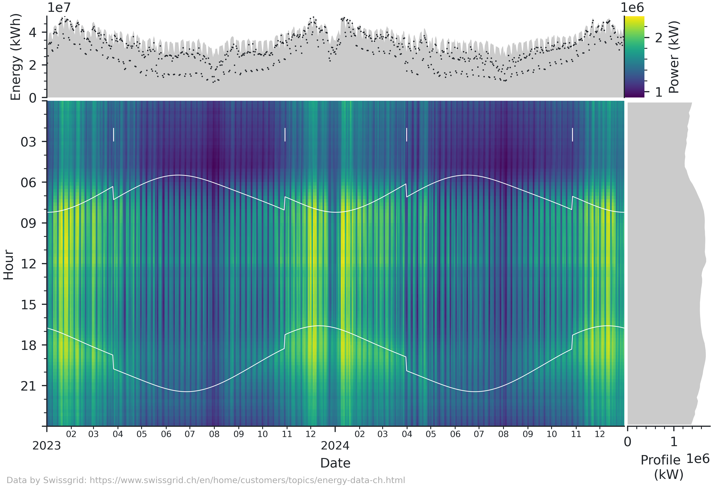

<p align="center" width="100%">

</p>

The classical time series heatmap plot extended with a mean profile and daily average and peaks.
This type of visualization is very informative when showing large amounts of time series data.
While I mostly use it for energy data, it can easily be adapted for any other time series.
The figure works best for data with a range of a few months to a few years and a resolution of a few minutes to a few hours.

<picture>
  <source media="(prefers-color-scheme: dark)" srcset="docs/sample-dark.png">
  
</picture>

<!-- ## Installation -->

<!-- The package is available on [PyPi](): -->
<!-- ```sh -->
<!-- pip install heatmapts -->
<!-- ``` -->

<!-- Alternatively, you can install it from GitHub: -->
<!-- ```sh -->
<!-- pip install git+https://github.com/markus-kreft/HeatmapTS -->
<!-- ``` -->
<!-- or simply clone this repository and work in the local directory. -->


## Usage

The module provides the `heatmapfigure` function that takes a pandas Series with a timezone-aware DatetimeIndex with frequency.

This example show how to load and prepare data from a csv file in the necessary way.
This needs to be adapted depending on the format of the data at hand.

```python
from heatmapts import heatmapfigure

# Read data
df = pd.read_csv('data.csv', index_col='Timestamp')
# Convert index to datetime and set timezone
df.index = pd.to_datetime(df.index, format='%Y-%m-%d %H:%M:%S').tz_convert('Europe/Zurich')
# Resample to 15 frequency
df = df.asfreq("15min", fill_value=pd.NA)
# Take data column and convert energy to power
series = df['Value'] * 4

fig = heatmapfigure(series, rasterized=True)
fig.savefig("plot.pdf")
```

## Customization

The figure is designed for easy customization.

- Any additional keyword arguments are passed to pcolormesh, which is especially convenient for using a different colormap or norm or to use rasterization.

<!-- norm = colors.TwoSlopeNorm(vcenter=0) | colors.CenteredNorm() -->
<!-- cmap = 'gist_rainbow_r' | 'guppy' | 'fusion_r' -->

- Passing a tuple of latitude and longitude coordinates will add sunrise and sunset times to the plot.

```python
fig = heatmapfigure(series, annotate_suntimes=(52.37, 4.90))
```

- The returned figure is subclassed from `matplotlib.figure.Figure` and features additional attributes for the heatmap, colorbar, daily and hourly axes.
These can be modified as any other matplotlib axis.

```python
fig.ax_heatmap.xaxis.set_major_locator(mdates.YearLocator())
fig.ax_heatmap.xaxis.set_major_formatter(mdates.DateFormatter("%Y"))
```

- The figure uses its own rcParams for styling.
  You can modify or overwrite the parameters on a class level.
  When setting an empty rcParams dictionary, the current parameters from matplotlib (e.g., as determined by `matplotlibrc`) will be used.

```python
from heatmapts import HeatmapFigure
# Customize rc parameters
HeatmapFigure.rc_params["font.family"] = "serif"
HeatmapFigure.rc_params["font.size"] = 5

# Set empty rc parameters to use those from matplotlib
HeatmapFigure.rc_params = {}
```
